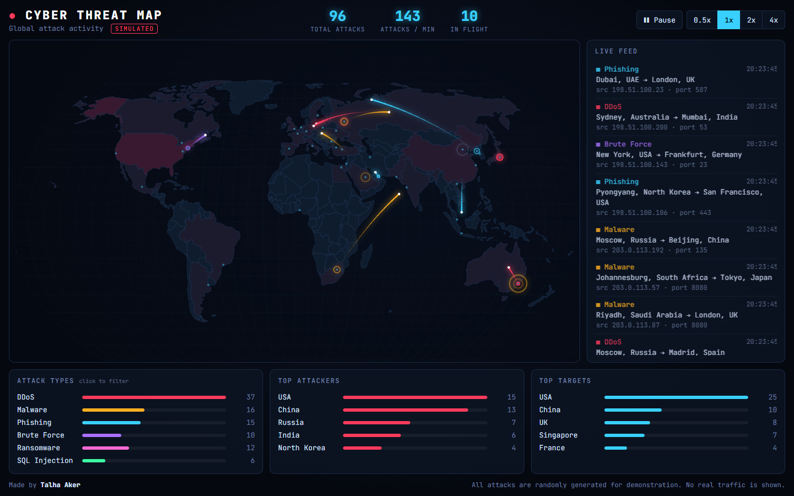

# 🌐 Cyber Threat Map


A real-time **cyber attack map** visualization built with **D3.js** and the **HTML5 Canvas**,
inspired by threat maps from security vendors such as Kaspersky, Check Point and Fortinet.

**🔴 Live demo:** https://t4lh8.github.io/Cyber-Threat-Map/



> ⚠️ **All attacks are simulated.** Events are randomly generated with realistic weights.
> No real network traffic is shown.

## Features

- **Animated attack arcs** from source to target with glowing projectiles and impact ripples
- **6 attack types**: DDoS, Malware, Phishing, Brute Force, Ransomware and SQL Injection, each with realistic target ports (22 SSH, 3389 RDP, 445 SMB...)
- **Heat map**: countries turn red as they receive more attacks
- **Live feed** with timestamp, route, source IP and port
- **Dashboard** with total attacks, attacks per minute, attack type breakdown and top attacker / target countries
- **Interactive**: hover a country for its stats, click an attack type to filter it, pause with `Space`, change speed (0.5x to 4x)
- **Responsive** layout for desktop and mobile

## How it works

| Layer | Technology | Role |
|---|---|---|
| World map | **D3.js** + **TopoJSON** (SVG) | Draws countries with the Natural Earth projection and colors them by attack count |
| Animations | **Canvas 2D** | Draws arcs, projectiles and ripples at 60 FPS, which is much faster than animating SVG elements |
| Simulation | Plain **JavaScript** | Weighted random selection of attack type, source and target |

Each attack travels along a **quadratic Bézier curve** that bows upward between the two cities.
The simulation runs on its own clock, so pausing or changing the speed freezes or scales every animation consistently.

### Safe by design

The fake source IPs are drawn **only from the RFC 5737 documentation ranges**
(`192.0.2.0/24`, `198.51.100.0/24`, `203.0.113.0/24`). These addresses are reserved for
examples and never belong to a real device, so the map never points at a real IP.

## Run locally

No build step or install is needed.

```bash
git clone https://github.com/t4lh8/Cyber-Threat-Map.git
cd Cyber-Threat-Map
```

Then open `index.html` in your browser. An internet connection is needed to load D3.js and the world map data.

### Tests

```bash
node --test
```

## Project structure

```
cyber-threat-map/
├── index.html
├── css/style.css
├── js/
│   ├── data.js         # attack types, ports, cities and weights
│   ├── simulator.js    # pure functions that generate attacks (unit tested)
│   └── app.js          # map, canvas animation, dashboard and controls
├── tests/
│   └── simulator.test.js
└── assets/screenshot.png
```

## What I learned

- Map **projections** and rendering **GeoJSON / TopoJSON** with D3.js
- Combining **SVG** (interactive shapes) with **Canvas** (fast animations) in a single view
- **Bézier curves** and a frame loop with `requestAnimationFrame`
- **Weighted random** selection to produce realistic-looking data
- Common attack types and the ports they target
- Why documentation IP ranges (**RFC 5737**) exist and when to use them
- Unit testing with Node's built-in test runner and running it with **GitHub Actions**

## Credits

- World map data: [world-atlas](https://github.com/topojson/world-atlas) (Natural Earth)
- Libraries: [D3.js](https://d3js.org/), [topojson-client](https://github.com/topojson/topojson-client)

## License

[MIT](LICENSE)
